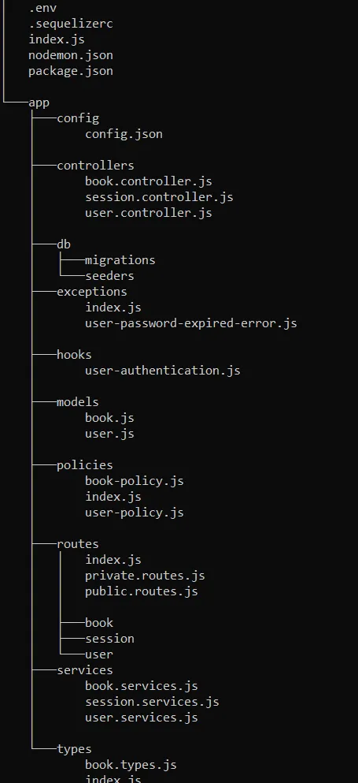

### Self-directed learning

### Technology used
1. Typescript
2. Node.js
3. Express
4. Nodemon
5. Postgres

### Project oriented learning

### Prerequesites: Javascript/Typescript

### First, we need to understand the tools we're using, and why we choose them.

- Typescript is a disciplined Javascript, with a strict sensitivity to data types. It is more efficient for catching errors.

- Node.js is a Javascript runtime environemnt that executes code outside of a web browser. Node.js helps us to use JS for server-side operations. Node.js has the necessary tools and APIs for executing Javascript code on the server

- Express is a popular Node.js web framework that allows us to build web applications and APIs. Express has the tools for tasks like routing, middleware integration and handlig http requests and responses. It offers a minimalist approach, allowing us to have a greater control over the structure and functionality of our applications. (RESTful APIs)

- Nodemon is a tool that automatically restarts the server whenever we make changes to the code.

- PostgreSQL is an object-relational database management system. It has robust features, extensibility, scalability and adherence to SQL standards.

### Second, Backend and project structure explained.
[Summary: Backend Application and its folder structure, Priya S Oct 29, 2022](https://medium.com/yavar/backend-application-and-its-folder-structure-ed631051faae)

- What is backend? The backend is known as the server side, and it consists of the server which provides data on request, the application that channels it, and the database which organized the information. Using API (software intermediary that allows two applications to talk to each other).

Sample project structure

#### PS: The nomenclature can vary, and as you will notice the extension of the files is js, but it doesn't when it comes to typescript

- index.js: it typically handles the app startup, routing, and other functions of the application

- .env: From the dotenv package, which is use for handling environment variables.

- package.json: the heart of any node project. It records important metadata about a project which is required before publishing to NPM(node package manager) and also it defines functional attributes of a project that npm uses to install dependencies, run scripts, and identify the entry point to the package.

- package-lock.json: This is created for locking the dependency with the installed version.

- nodemon.json: It supports local and global configuration files. The file can be used to add some extra configurations to our application to allow us to monitor multiple directories, ignore files, and delay restarting amongst others.

- .sequelizerc: It's a special configuration file. It provides a path to the config file.

- config.json: This is the main configuration file and contains all default environment variables.

- controllers: The controllers are responsible for handling incoming requests and returning responses to the client. Its main purpose is to receive specific requests for the application.

- services: The services handle all the logic between the incoming request and returning the response.

- exceptions: It handles the exception errors that arise in the application, for example session timeout errors..

- hooks: It allows the programmer to insert customized programming. This allows you to listen to specific events in the application or request/response lifecycle. For example, token authentication can be done here using a prehandler. The prehandler is a hook in fastify which in invoked by any incoming request.

- models: The models are used to communicate with the database. It is an intermediary between the database and the controllers.

- routes: It has the call route methods and the controller to execute when it is called. It has private routes and public routes. In the public routes, anyone can access it. It does not require any authorization. But in the case of private routes, it requires authorization to visit a particular route (for example to read or update the user details).

- types: It defines the type of the payload, request, and response parameters.

- policies: Policies are designed to let you add common types of management capabilities to an API easily and reliably. It provides security. 

- db: This folder defines the structures of the tables with the column names and their datatypes. It has two sub-folders.

- Migrations — Migrating databases automatically syncing databases in all of the environments.
Seeders — Seeding a database is a process in which an initial set of data is provided to a database when it is being installed.

### Third, Let's start coding and practicing- the only ways you can master programming.

### Example Project: todo app api

The todo app api will have, user authentication, user email verification, forgot password help, reset password help, resend token password, tasks crud operations: creating a task, viewing all the tasks, updating a task and deleting a task.

I will use, typeorm for database operations, nodemailer and gmail for sending emails.. zod for schemas and input validation. I will also add pagination and an api documentation using swagger

Bonus, I will make a simple frontend and try to connect it to that backend!

